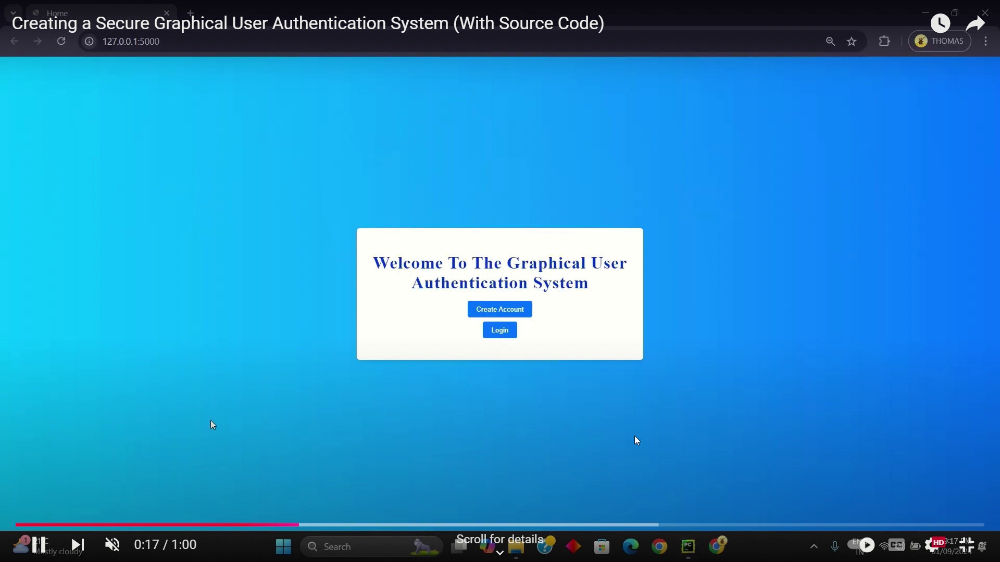
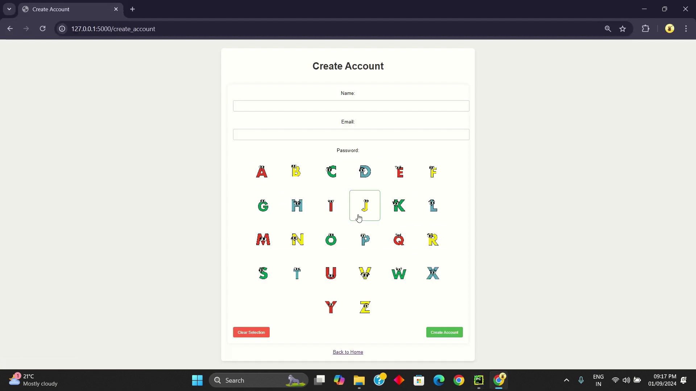
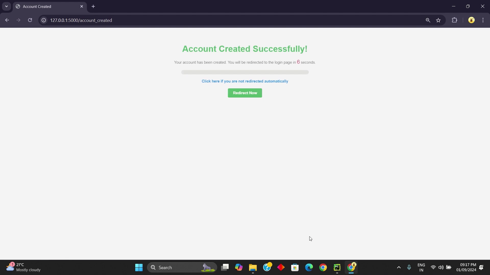
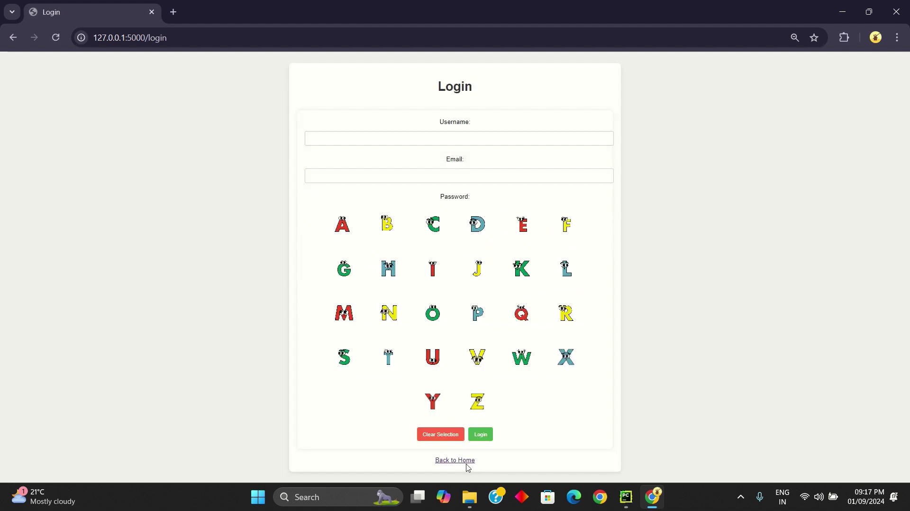

# Fun Login Experience 🎉🔐

Welcome to the **Fun Login Experience**! 🚀 Ever imagined logging in could be this much fun? Well, here’s a project that turns the mundane into the magical! ✨

## What’s the deal? 🤔

### Q: What makes this login experience "fun"?
A: We’ve turned your everyday login into an interactive, image-based adventure! Who needs boring passwords when you can select images instead? 🎨

### Q: Is it secure? 🔒
A: Absolutely! Not only is it fun, but it’s also backed by the solid security practices you expect. Playful yet powerful! 💪

### Q: Can I try it out? 👀
A: Of course! Clone the repo, follow the setup instructions, and you’re good to go. Dive into the fun! 😄

### Why should you care? 🤷‍♂️
Because life’s too short for boring logins. Upgrade your user experience and keep things playful while staying secure.

### Check A output of this project!

## MIT License 📜

This project is licensed under the MIT License - see the [LICENSE](./LICENSE) file for details.

---

Made with ❤️ by [Thomas A](https://www.linkedin.com/in/thomas-a-008a60249/). Check out the [YouTube demo](https://youtu.be/KR6A00FT9I8) and show some love by starring the repo! ⭐
